# 后台管理系统-开发记录


## 一、基本项目搭建

### 依赖、项目搭建

1. 安装依赖
```shell
  pnpm init
  pnpm i koa dotenv nodemon
```
2. 配置脚本

`package.json`

```json
"scripts": {
    "dev": "nodemon ./src/main.js"
}
```
3. 运行
```shell
pnpm run dev
```

### 环境配置

`./src/config/default.config.js`

```js
const dotenv = require('dotenv')
dotenv.config()	// 执行后会自动找到项目根目录的.env文件加载，把配置项全部写入process.env中

module.exports = process.env	// 导出配置，方便使用时直接解构获取配置
```

`.env`

```
SERVER_PORT=21213	# 服务端口
```

### 项目初始化

```js
const Koa = require('koa')

const { SERVER_PORT } = require('./config/config.default')
const app = new Koa()

app.use((ctx, next) => {
  ctx.body = 'Hello,Koa2.'
})
app.listen(SERVER_PORT, () => {
  console.log(`server is running on: http://localhost:${ SERVER_PORT }`)
})
```

### 效果

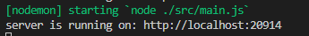

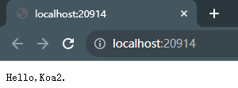

### 优化

对于整个项目来说，`Koa`属于第三方工具，可以把`Koa`相关的代码单独抽离出来，`main.js`只需要做引用配置，获取应用实例，监听端口等操作即可。这样做可以让代码结构，分工更加清晰。

后续再有其他的功能引入，均在`./src/app/index.js`编写实现。

`./src/app/index.js`

```js
const Koa = require('koa')
const app = new Koa()

module.exports = app
```

`./src/main.js`

```js
const app = require('./app')
const { SERVER_PORT } = require('./config/config.default')

app.listen(SERVER_PORT, () => {
  console.log(`server is running on: http://localhost:${ SERVER_PORT }`)
})
```

现在可能感受还不太深，在下一章引入`@koa/router`后，感受可能会加深！


## 二、路由配置

### 依赖安装

```shell
pnpm i @koa/router
```

### 路由编写

`./src/router/index.route.js`

```js
const Router = require('@koa/router')

const router = new Router()

router.get('/', (ctx, next) => {
    ctx.body = 'Hello Koa2!!'
})

module.exports = router.routes()	// 返回一个函数，此函数可作为中间件
```

`./src/router/user.route.js`

```js
const Router = require('@koa/router')

const router = new Router({
    prefix: '/user'	// 定义此路由的前缀
})

router.get('/', (ctx, next) => {
    ctx.body = [
        { id: 1, name: 'jeffrey', age: 27 }
    ]
})

module.exports = router.routes()
```

`./src/app/index.js`

```js
const Koa = require('koa')

const indexRoute = require('../router/index.route.js')
const userRoute = require('../router/user.route.js')

const app = new Koa()

app.use(indexRoute)
app.use(userRoute)

module.exports = app
```


### 效果

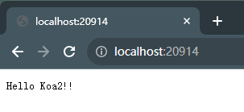

<div align="center">index路由</div>

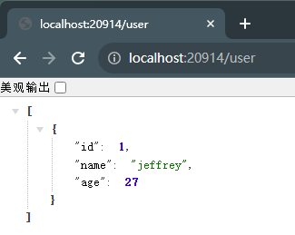

<div align="center">user路由</div>

### 优化

可以看到每次定义新的路由块，都需要引入新的模块，并用`app.use(xxxRoute)`来执行，这个动作其实是可以自动完成的。

`./src/router/index.js`

```js
const fs = require('fs')
const Router = require('@koa/router')

const router = new Router()

const fileList = fs.readdirSync(__dirname)
fileList.forEach(filename => {
    if(filename !== 'index.js') {
        router.use(require(`./${ filename }`))
    }
})

module.exports = router.routes()
```

`./src/app/index.js`

```js
const Koa = require('koa')
const routes = require('./router')	// 只需要引入一个模块即可

const app = new Koa()

app.use(routes)	// 一次性全部导入

module.exports = app
```


## 三、控制器 Controller

`router`应该是只用来管理路由，里面具体的实现逻辑，应该单独抽离出来，代码才能更清晰。对于逻辑控制这一层，我们都放在`controller`中进行管理。

`./src/controller/user.controller.js`

```js
class UserController {
    login(ctx, next) {
        ctx.body = {
            code: 2000,
            data: null,
            message: '登录成功！'
        }
    }
    register(ctx, next) {
        ctx.body = {
            code: 2000,
            data: null,
            message: '注册成功！'
        }
    }
}

module.exports = new UserController()	// 暴露出去的应该是一个实例，使用时可直接结构获取里面的函数
```

`./src/router/user.route.js`

```js
const Router = require('@koa/router')

const { login, register } = require('../controller/user.controller.js')	// 引用时直接解构获取处理函数

const router = new Router({
    prefix: '/user'
})

/* 不写逻辑，只写路由 */
router.post('/login', login)
router.post('/register', register)

module.exports = router.routes()
```


### 补充内容：解析post请求中的请求体body

1. 依赖下载

   ```shell
   pnpm i koa-body
   ```

2. 注册中间件

   `./src/app/index.js`

   ```js
   const Koa = require('koa')
   const { koaBody } = require('koa-body')
   const routes = require('../router')
   
   const app = new Koa()
   
   app.use(koaBody())	// 注册koa-body中间件
   app.use(routes)
   
   module.exports = app
   ```

3. 在`ctx.request.body`中获取请求体数据

   `./src/controller/user.controller.js`

   ```js
   class UserController {
       register(ctx, next) {
           console.log(ctx.request.body)	// 从ctx.request.body中获取请求体数据
           ctx.body = {
               code: 2000,
               data: ctx.request.body,
               message: '注册成功'
           }
       }
   }
   module.exports = new UserController()
   ```

4. 效果

   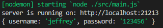


## 四、服务层 Service

在`controller`中应该是针对业务的具体逻辑进行处理，对于`数据`的具体操作（即操作`数据库`），应该单独抽离出来处理，我们统一放在`service`中进行处理。

`./src/service/user.service.js`

```js
class UserService {
    async createUser(params) {
        try {
            const {
                username,
                password
            } = params
            
            return Promise.resolve('用户添加成功！')
        } catch (err) {
            return Promise.reject(err)
        }
    }
}

module.exports = new UserService()
```

`./src/controller/user.controller.js`

```js
const { createUser } = require('../service/user.service.js')
class UserController {
    async register(ctx, next) {
        try {
            await createUser(ctx.request.body)
            ctx.body = {
                code: 2000,
                data: ctx.request.body,
                message: '恭喜！用户注册成功！'
            }
        } catch (err) {
            console.error(err)
            ctx.body = {
                code: 5000,
                data: null,
                message: '用户注册失败' + err
            }
        }
    }
}

module.exports = new UserController()
```

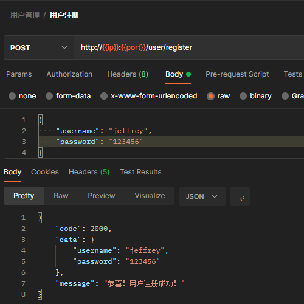

<div align="center">效果-注册成功</div>

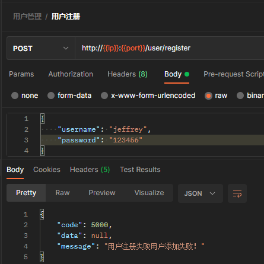

<div align="center">效果-注册失败</div>

## 五、数据库

### 依赖安装

```shell
pnpm i sequelize mariadb
```

### 连接数据库

要连接到数据库，必须创建一个`Sequelize`实例

`./src/db/seq.js`

```js
const { Sequelize } = require('sequelize')

const {
  DB_HOST,
  DB_PORT,
  DB_DATABASE,
  DB_USERNAME,
  DB_PWD,
  DB_DIALECT,
} = require('../config/default.config')

const seq = new Sequelize({
  host: DB_HOST,
  port: DB_PORT,
  database: DB_DATABASE,
  username: DB_USERNAME,
  password: DB_PWD,
  dialect: DB_DIALECT
})

// 测试连接
testConnectDatabase()
async function testConnectDatabase() {
  try {
    await seq.authenticate()
    console.log('数据库连接成功！')
  } catch (err) {
    console.error('数据库连接失败！', err)
  }
}

module.exports = seq
```

`.env`

```
# 服务端口
SERVER_PORT=21213

# 数据库配置信息
DB_HOST=192.168.0.111
DB_PORT=3306
DB_DATABASE=my_db
DB_USERNAME=root
DB_PWD=123456
DB_DIALECT=mariadb
```

使用`seq.authenticate()`可测试数据库是否连接成功，它会返回一个Promise。

## 六、模型 Model

`模型`与`数据表`对应，例如我们有一张用户表`t_user`，即可对应创建一个用户模型`User`，在模型中定义每个字段的类型、约束等信息。

在`sequelize`中，定义模型有两种方法：

- 调用`sequelize.define(modelName, attributes, options)`
- 扩展`Model`并调用`init(attributes, options)`

### 定义

`./src/model/user.model.js`

```js
const seq = require('../db/seq')
const { DataTypes } = require('sequelize')

// define函数的第一个参数是模型名称的定义
// 如果没用在options中定义表名，则会根据模型名称生成对应的复数形式作为表名。
const User = seq.define('user', {
  user_name: {
    type: DataTypes.CHAR(64),
    allowNull: false,
    unique: true,
    comment: '用户名'
  },
  password: {
    type: DataTypes.CHAR(255),
    allowNull: false,
    comment: '密码'
  },
  nick_name: {
    type: DataTypes.CHAR(64),
    comment: '昵称'
  },
  is_deleted: {
    type: DataTypes.INTEGER,
    allowNull: false,
    defaultValue: 0,
    comment: '是否被删除: 0:未删除 1:已删除'
  },
}, {
    tableName: 't_user'	// 定义表明
})

// 同步数据表
User.sync({
    alert: true
})

module.exports = User
```

调用`User.sync()`后，`数据库`就会生成与`模型`对应的`数据表`，如果没用做其他定义，会自动补充`id`、`createAt`、`updateAt`三个字段。


### 使用

有了模型以后，我们就可以在`service`层开始操作数据库了

#### 1.创建

`./src/service/user.service.js`

```js
const User = require('../model/user.model')

class UserService {
    async createUser(params) {
        const user = await User.create(params)
        console.log(JSON.stringify(user, null, 4))
        return user
    }
}

module.exports = new UserService()
```

> `Model.create()`方法是使用`Model.build()`构建未保存实例，并使用`Model.save()`保存实例的简写形式.
>
> ```js
> const user = User.build({ name: "Jeffrey" });
> await user.save();
> ```

#### 2.其他操作

关于其他操作，具体可直接看[官方文档](https://www.sequelize.cn/core-concepts/model-querying-basics)。


## 七、中间件

​	在控制层`controller`中，可以添加一些请求验证的逻辑，例如`用户注册`，需要在调用`service`之前，先对用户请求的参数做验证，判断其是否为空、用户名是否已存在等。

​	但如果把这些验证逻辑全部写在`controller`中，代码会显得很繁杂，最好的办法就是用`中间件`,在调用`controller`之前，先调用`中间件`，确保验证通过了之后才调用`controller`。

`./src/middleware/user.middleware.js`

```js
const userRegisterValidator = async (ctx, next) => {
    const { user_name, password } = ctx.request.body
    
    if(!user_name || !password) {
        ctx.body = {
            code: '4000',
            message: '用户名或密码为空',
            result: null
        }
        return
    }
    
    await next()
}

module.exports = {
    userRegisterValidator
}
```

`./src/router/user.route.js`

```js
const Router = require('@koa/router')

const { register } = require('../controller/user.controller.js')
const { userRegisterValidator } = require('../middleware/user.middleware')

const router = new Router({
  prefix: '/user'
})

// 在调用register之前，先调用userRegisterValidator
router.post('/register', userRegisterValidator, register)


module.exports = router.routes()
```


## 八、统一的错误处理函数

​	为了提高代码的健壮性，除了编辑业务本身的处理逻辑以外，还应该在外层嵌套`try..catch`，以保证出现错误时及时错误对应的处理动作。

​	使用`app.on`来监听错误事件，当我们`catch`到错误时，调用`ctx.app.emit`来触发错误事件。

`./src/controller/user.controller.js`

```js
const UserService = require('../service/user.service')
const { serviceError } = require('../constants/error.type')

class UserController {
    async register(ctx, next) {
        try {
            const result = await UserService.createUser(ctx.request.body)
            ctx.body = {
                code: '2000',
                result,
                message: '恭喜！用户注册成功'
            }
        } catch (error) {
            // 在catch中触发`error`事件
            ctx.app.emit('error', {
                errorObj: getErrorObj(serviceError),
                ctx,
                error
            })
        }
    }
}
```

`./src/app/index.js`

```js
const Koa = require('koa')
const { koaBody } = require('koa-body')

const routes = require('../router')
const errorHandler = require('./errorHandler')

const app = new Koa()

app.use(koaBody())
app.use(routes)

app.on('error', errorHandler) // 错误处理

module.exports = app
```

`./src/app/errorHandler.js`

```js
module.exports = (opts) => {

  const {
    responseBody,
    ctx,
    error
  } = opts
  try {
  
    let status = 500
    switch (responseBody.code) {
      case '4000':
        status = 400
        break;
      case '5000':
        status = 400
        break;
      default:
        status = 500
        break;
    }
    ctx.status = status
    ctx.body = responseBody
    console.error('捕获到错误信息：', error)

  } catch (err) {
    console.error(opts)
    console.error('错误处理函数出错：', err)
  }
}
```


## 九、加密/解密

### 依赖安装

```shell
pnpm i bcryptjs
```

### 密码加密

对于加密的逻辑，可以写一个`中间件`去执行。加密时间点，可以放在参数验证成功之后。

`./src/middleware/user.middleware.js`

```js
const bcrypt = require('bcryptjs')

// 用户注册参数验证
const userRegisterValidator = (ctx, next) => {...}
// 密码加密
const cryptPssword = (ctx, next) => {
  const { password } = ctx.request.body
  
  const salt = bcrypt.genSaltSync(10)
  const hash = bcrypt.hashSync(password, salt)
  ctx.request.body.password = hash

  await next()
}

module.exports = {
  userRegisterValidator,
  cryptPssword
}
```

`./src/router/user.route.js`

```js
const Router = require('@koa/router')

const { register } = require('../controller/user.controller.js')
const { userRegisterValidator, cryptPassword } = require('../middleware/user.middleware')

const router = new Router({
  prefix: '/user'
})

// 加上密码加密的中间件
router.post('/register', userRegisterValidator, cryptPassword, register)

module.exports = router.routes()
```

#### 效果

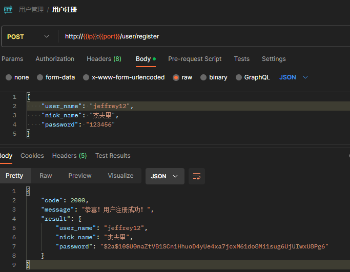

### 密码解密对比

当用户登录时，需要先将用户传递的密码，与数据库中的密码进行比对，这个时候就需要对数据库的密码进行解密比对，比对成功以后，才允许用户登录。

我们可以写一个针对密码验证的中间件`validatePassword`

`./src/middleware/user.middleware.js`

```js
const UserService = require('../service/user.service')
const {
  paramsFormatError,
  loginUserNameOrPasswordError,
} = require('../constants/error.type')
const { getResponseBody } = require('../utils')
const bcrypt = require('bcryptjs')

// 密码验证
const validatePassword = async (ctx, next) => {
  try {

    const { user_name, password } = ctx.request.body
    const user = await UserService.getUserInfo({ user_name })
  	// 1.用户存在；2.解密后对比密码一致
    if(user && bcrypt.compareSync(password, user.password)) {
      await next()
    } else {
      return ctx.app.emit('error', {
        responseBody: getResponseBody(loginUserNameOrPasswordError),
        ctx,
        error: new Error(loginUserNameOrPasswordError.message)
      })
    }
    
  } catch (error) {
    return ctx.app.emit('error', {
      responseBody: getResponseBody(userLoginError),
      ctx,
      error
    })
  }
}

module.exports = {
  validatePassword
}
```


## 十、颁发token

token是由三部分组成的：

1. header 头部信息

   ```json
   {
       "typ": "JWT",
       "alg": "HS256"
   }
   ```

2. 载体payload，用于存放自定义的信息

3. signature签证信息


通常在我们登录成功以后，都需要生成一个token令牌返回，之后对于其他需要验证登录的接口，只需要用户在`请求头`中传递`Authorization`，验证通过以后，即可允许用户调用。

### 依赖下载

```shell
pnpm i jsonwebtoken
```

### 登录功能

使用`jsonwebtoken`颁发token，需要传`payload`和`密钥信息`

`./.env`

```
# 登录密钥
JWT_SECRET=123456
```

`./src/controller/user.controller.js`

```js
const UserService = require('../service/user.service')
const { RES_CODE_SUCCESS } = require('../constants')
const {
  serviceError,
  userLoginError,
  paramsFormatError,
  userNotFoundError,
} = require('../constants/error.type')
const { getResponseBody } = require('../utils')
const { JWT_SECRET } = require('../config/default.config')

const jwt = require('jsonwebtoken')

class UserController {

  async login(ctx) {
    try {
      const { user_name } = ctx.request.body
      // 小技巧：将返回的用户信息，剔除password后保存在userInfo中
      const { password, ...userInfo } = await UserService.getUserInfo({ user_name })
      // expiresIn是过期时间
      const token = jwt.sign(userInfo, JWT_SECRET, { expiresIn: '30d'})
      ctx.body = getResponseBody({
        code: RES_CODE_SUCCESS,
        message: '用户登录成功！',
        result: {
          token
        }
      })
    } catch (error) {
      ctx.app.emit('error', {
        responseBody: getResponseBody(userLoginError),
        ctx,
        error
      })
    }
  }

}

module.exports = new UserController() // 暴露出去的应该是一个实例，使用时可直接结构获取里面的函数

```

#### 效果

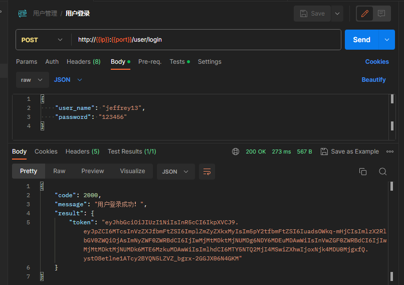

### token验证

当我们调用其他需要登录验证的接口时，需要从请求头拿到token，对比验证后才继续执行后续操作。

针对这个验证，可以写一个中间件`auth`

`./src/middleware/auth.middleware.js`

```js
const jwt = require('jsonwebtoken')
const { serviceError, tokenExpired, invalidToken } = require('../constants/error.type')
const { getResponseBody } = require('../utils')
const { JWT_SECRET } = require('../config/default.config')

const auth = async (ctx, next) => {
  try {
    // 从请求头中获取authorization
    const { authorization = '' } = ctx.request.header
    // 需要切割`Bearer `
    const token = authorization.replace('Bearer ', '')
    // 根据token和密钥进行token验证
    const userInfo = await jwt.verify(token, JWT_SECRET)
    // 将获取到的userInfo保存到ctx的state状态，之后就可以直接从ctx.state去获取到用户信息了
    ctx.state.userInfo = userInfo
    await next()
  } catch (error) {
    // jwt.verify会抛出三种错误类型：
    switch(error.name) {
      // token过期
      case 'TokenExpiredError':
        return ctx.app.emit('error', {
          responseBody: getResponseBody(tokenExpired),
          ctx,
          error
        })
      // token错误
      case 'JsonWebTokenError':
        return ctx.app.emit('error', {
          responseBody: getResponseBody(invalidToken),
          ctx,
          error
        })
      // 其他情况
      default:
        return ctx.app.emit('error', {
          responseBody: getResponseBody(serviceError),
          ctx,
          error
        })
    }
  }
}

module.exports = {
  auth
}
```

`./src/router/user.route.js`

```js
const Router = require('@koa/router')

const { auth } = require('../middleware/auth.middleware')

const router = new Router({
  prefix: '/user'
})

// 用户信息（根据ID获取）
router.get('/:id', auth, (ctx) => {
    const userInfo = ctx.state.userInfo
    console.log('userInfo', userInfo)
    // 这里就不写service逻辑了，主要演示一下可以做到验证token和从state中获取保存的payload
    ctx.body = {
        code: 2000,
        result: userInfo,
        message: '获取成功'
    }
})

module.exports = router.routes()
```

#### 效果

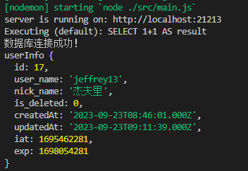


## 十一、图片上传/获取

#### 图片上传

`koa-body`本身即可支持文件上传，需要做一下配置

##### 1.`koa-body`配置

`./src/app/index.js`

```js
const path = require('path')

const Koa = require('koa')
const { koaBody } = require('koa-body')

const app = Koa()

const uploadDir = path.join(__dirname, '../uploadDir')	// 存放文件的目录

app.use(KoaBody({
    multipart: true,
    formidable: {
        uploadDir,
        keepExtensions: true
    }
}))

module.exports = app
```

补充了配置以后，即可编写接口

##### 2.`File`模型

`./src/model/file.model.js`

```js
const { DataTypes } = require('sequelize')
const seq = require('../db/seq')

const File = seq.define('file', {
  file_name: DataTypes.CHAR,
  original_file_name: DataTypes.CHAR,
  mime_type: DataTypes.CHAR,
  file_path: DataTypes.CHAR
}, {
  tableName: 't_files'
})

File.sync({
  alter: true
})

module.exports = File
```

##### 3.`route`接口路由

`./src/router/file.route.js`

```js
const KoaRouter = require('@koa/router')

const { uploadFile } = require('../controller/file.controller')

const router = new KoaRouter({
  prefix: '/file'
})

router.post('/uploadImg', uploadFile)


module.exports = router.routes()

```

##### 4.`controller`

`./src/controller/file.controller.js`

```js
const FileService = require('../service/file.service')
const { getResponseBody } = require('../utils')

const { fileUploadError } = require('../constants/error.type')

const uploadFile = async (ctx, next) => {
  try {
    const { file } = ctx.request.files
    
    const { file_name } = await FileService.createFile(file)

    ctx.app.emit('success', {
      ctx,
      responseBody: getResponseBody({
        message: '上传成功！',
        result: file_name
      })
    })
  } catch (error) {
    ctx.app.emit('error', {
      ctx,
      error,
      responseBody: getResponseBody(fileUploadError)
    })
  }

}
module.exports = {
  uploadFile
}
```

##### 5.`service`

`./src/service/file.service.js`

```js
const File = require('../model/file.model')

class FileService {
  async createFile (file) {
    const {
      newFilename,
      originalFilename,
      mimetype,
      filepath
    } = file
    return await File.create({
      file_name: newFilename,
      original_file_name: originalFilename,
      mime_type: mimetype,
      file_path: filepath,
    })
  }

}

module.exports = new FileService()
```

##### 6.效果

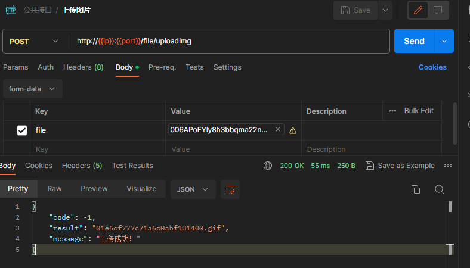

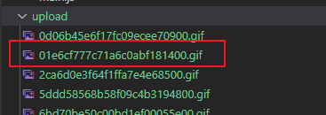

#### 图片获取

##### 1.`koa-static`依赖安装

```shell
pnpm i koa-static	# 用于搭建静态目录
```

##### 2.配置`koa-static`

`./src/app/index.js`

```js
const path = require('path')

const Koa = require('koa')
const KoaStatic = require('koa-static')

const uploadDir = path.join(__dirname, '../../upload')

const app = new Koa()

app.use(KoaStatic(uploadDir))	// 配置静态目录

module.exports = app
```

##### 3.直接根据文件名即可访问

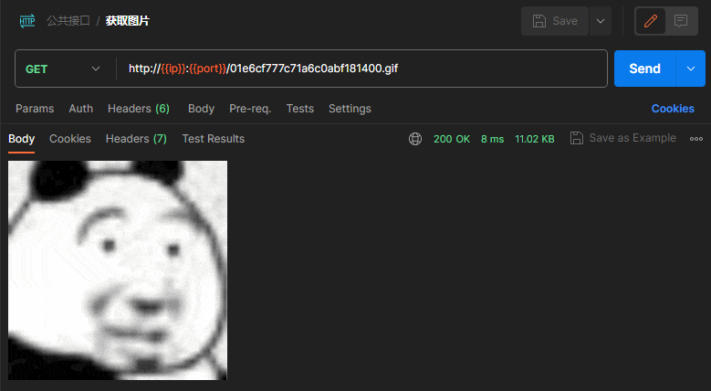
